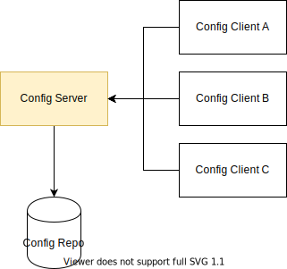

# Config Server

A containerized, externalized and centralized configuration server implemented with **Spring Cloud Config** and **Docker**.



External clients request the config server about their configuration files. The config server fetches data from a remote Git repository and feeds it back to the requesting clients.

## Dependencies

- Config Repo

## Usage

Follow the instructions at [Docker Hub](https://hub.docker.com/r/bandrefilipe/config-server) or:

1. Clone this repository:
```sh
$ git clone https://github.com/bandrefilipe/config-server.git
```

2. Navigate into the `config-server` directory:
```sh
$ cd config-server
```

3. Build the docker image:
```sh
$ docker build [OPTIONS] .
```
> e.g. `$ docker build -t bandrefilipe/config-server .`

4. Create the docker container:
```sh
$ docker create [OPTIONS] IMAGE [ARG...]
```
> e.g. `$ docker create -p 9999:8888 -e GIT_URI={url} -e GIT_USERNAME={username} -e GIT_PASSWORD={secret} --name config-server bandrefilipe/config-server`  
> Consider using an [env-file](https://docs.docker.com/engine/reference/commandline/run/#set-environment-variables--e---env---env-file).

5. Run the docker container:
```sh
$ docker start [OPTIONS] CONTAINER [CONTAINER...]
```
> e.g. `$ docker start -a config-server`

### Docker Environment Parameters

The application exposes a few customizable parameters which can be passed as environment variables during container creation (step 4, right above):

|PARAMETER|DEFAULT|DESCRIPTION|
|:---|:---:|:---|
|`GIT_URI`|n/a|**(REQUIRED)** The Git repository's URI from which the config server shall fetch clients' property files.|
|`GIT_USERNAME`|n/a|**(REQUIRED)** The Git repository's username.|
|`GIT_PASSWORD`|n/a|**(REQUIRED)** The Git repository's password.|
|`GIT_TIMEOUT`|`4`|The time, in seconds, that the config server will wait to acquire an HTTP connection.|
|`GIT_SKIP_SSL_VALIDATION`|`false`|The config server's validation of the Git server's SSL certificate.|
|`GIT_SEARCH_PATHS`|`{application}`|_Refer to the Spring Cloud Config Server's documentation for the use of the_ `git.searchPaths` _property_.|
|`GIT_FORCE_PULL`|`true`|Dictates if either the config server shall force pulling the remote repository content or not.|
|`GIT_DELETE_UNTRACKED_BRANCHES`|`true`|_Refer to the Spring Cloud Config Server's documentation for the use of the_ `git.deleteUntrackedBranches` _property_.|
|`GIT_REFRESH_RATE`|`0`|The time, in seconds, in which the config server will fetch updated configuration data from the Git repository. The default value (`0`) means: only when requested by clients.|
|`GIT_BASEDIR`|`/tmp/.config-repo`|The location in which the checked out or cloned git or svn files will be stored. This location resides **inside** the container. It's of no use changing it, unless if you want to specify a custom location when creating a docker volume for local, non-volatile, file storage.|

Check, if necessary, the [bootstrap.properties](./src/main/resources/bootstrap.properties) file for further documentation.

## Employed Technology

|||||
|:---:|:---:|:---:|:---:|
